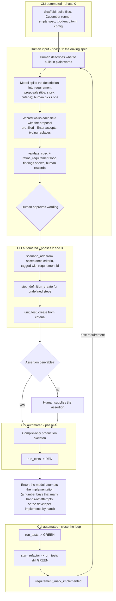

# bdd — spec-driven BDD/TDD CLI

[](https://github.com/davidparry/tdd-bdd-agentic/actions/workflows/ci.yml)
[](https://github.com/davidparry/tdd-bdd-agentic/actions/workflows/ci.yml)
[](https://github.com/davidparry/tdd-bdd-agentic/releases/latest)
[](../.github/workflows/ci.yml)

One native binary for the whole spec-driven loop (spec → Gherkin → RED →
GREEN → REFACTOR) with an embedded MCP server that keeps the seven
`tdd-workflow-server` tool contracts.

**Full command manual:** every command, subcommand, and flag with
in-depth examples, searchable —
[davidparry.github.io/tdd-bdd-agentic/manual](https://davidparry.github.io/tdd-bdd-agentic/manual/).
Source lives in [`manual/src`](manual/src); rebuild with
`mdbook build cli/manual` from the repository root (`cargo install
mdbook` once). The built book is committed under `docs/manual/` so
GitHub Pages serves it.

## The core theme

**The requirements spec is the source of truth, and the discipline is
enforced by tooling, not by convention.** Everything else follows from
that one idea:

- The spec is machine-validated (`validate_spec`) *and* its wording is
  quality-gated (`refine_requirement`) before any scenario or code
  exists — a valid-but-vague requirement is caught and reworded first.
- Behavior flows downhill from the approved spec: Gherkin scenarios
  tagged with requirement ids, step definitions, unit tests, and only
  then production code.
- The Red/Green/Refactor cycle is a state machine, not a suggestion:
  `start_refactor` is refused on a red bar, every reply names the next
  step, and a requirement is only marked implemented behind a green bar.
- Agents get no escape hatches: no file writes, no shell, no dependency
  installation — every mutation goes through a typed, validated tool,
  and the same tools serve humans (CLI) and agents (embedded MCP server)
  identically.
- The LLM is local by default (Ollama), discovered rather than assumed,
  and generation degrades gracefully to authoring-only when it — or a
  language runtime — is missing. Nothing is ever installed for you. This
  CLI is developed and run against `qwen3-coder-next:latest`; see
  [Ollama model](#ollama-model).

The CLI grew out of a talk and hands-on class that teaches spec-driven
development with BDD and TDD — this repository is that workshop (see
[../student-follow-along.md](../student-follow-along.md)). The class
walks students through the loop with the Java `tdd-workflow-server`.
To finish the same kata with this binary instead, follow
[../student-follow-docs/cli-path.md](../student-follow-docs/cli-path.md).

## How it differs from the closest projects

Stated as facts about what each tool does and does not do:

- **GitHub Spec Kit** — a phase workflow (specify, plan, tasks,
  implement) for AI agents over markdown specs. Its specs are prose for
  agents to interpret, not executable Gherkin; it has no test-state
  machine and does not run or gate on tests.
- **csdd** — the nearest single project in spirit: one Go binary whose
  CLI is the only sanctioned author of workflow artifacts, with phase
  gates exposed as MCP tools. It is built specifically for Claude Code,
  and its artifacts are its own spec format — not Cucumber features
  executed by the project's own test runner.
- **agnostic-agent-loop** — decomposes agent tasks into RED, GREEN, and
  REFACTOR sub-tasks. The phases are task structure, not an enforced
  state machine; there is no requirements spec with structural
  validation and wording refinement driving what gets built.
- **StepWeaver, ScenarioAI, UUV** — LLM-assisted Gherkin and
  step-definition generators (some Ollama-capable). They generate test
  artifacts; they do not manage a requirements spec, gate on wording
  quality, or track and enforce the Red/Green/Refactor cycle.

No existing tool combines a machine-validated spec with a wording
refinement gate, real Cucumber across JVM, JavaScript/TypeScript, .NET,
and Rust projects, an enforced TDD state machine, typed mutations with
no file/shell escape hatches, an embedded MCP server with a frozen tool
contract, and a local-only LLM — in one native binary. That combination
is why this exists.

## Status

Every roadmap phase through greenfield mode has landed, with clean
architecture and full test coverage throughout:

- `bdd spec list | show | validate | refine` — the `list_requirements`,
  `get_requirement`, `validate_spec`, and `refine_requirement` behaviors,
  ported from the Java `tdd-workflow-server` with byte-identical reply
  strings.
- `bdd spec draft | mark-implemented` — interactive drafting where the
  human words the spec and validate/refine findings drive rewording
  until clean. With a resolved model, drafting starts from a plain-words
  description the model splits into proposals, and findings are sent to
  the model so the rewording prompts carry its fixes (Enter accepts).
  `mark-implemented` is refused off a green bar and without a scenario
  tagged `@REQ-...`; it records the tagged feature as the requirement's
  `featureFile` so the spec keeps validating, and re-running it
  backfills a missing `featureFile`.
- `bdd feature list | show | create` and
  `bdd scenario add | update | delete` — typed Gherkin reads and
  mutations, parsed back before they are staged so broken syntax can
  never land.
- `bdd changes show | commit | discard` and `bdd validate` — every
  mutation goes to a staging area (`.bdd-staged/`) first; the human
  reviews and applies, and `validate` checks spec plus staged Gherkin
  together before commit. After applying, `commit` re-validates the
  working tree and carries any open issues in its reply as a warning,
  so an invalid spec never lands silently.
- `bdd test | state | refactor` — the Red/Green/Refactor state machine,
  persisted as a timestamped log in `.bdd-state.json` across invocations
  (interpretation instructions in the file; model briefs get only the
  three latest entries), executing through Maven, cucumber-js,
  `dotnet test`, or `cargo test` depending on the detected project, with
  fixture-tested report parsers.
- `bdd steps missing | generate` and `bdd unittest generate` — step
  discovery per framework and hybrid generation: deterministic templates
  always work, a resolved Ollama model's output is preferred when it
  validates, and everything lands in staging. Every code-producing
  prompt pins the session language's best practices — package naming
  for Java, snake_case modules for Rust, and their kin for JS/TS and
  .NET — so generated code follows the ecosystem's conventions.
- `bdd implement` — the model attempts to make the failing tests pass:
  production code plus real bodies for the generated placeholders, fed
  by the last run's full failure details (stack traces included) and
  the logged history of every prior attempt — what it wrote, what it
  was fixing, and what the build/test run after it actually reported —
  staged for review. A
  preflight surveys the prerequisites first — tagged scenario, step
  definitions, unit test, a recorded RED bar — and when one is missing
  it names the step to take instead (with a model advice call when one
  is resolved). After staging, a terminal gets the follow-up offer
  `Apply the staged files and run the tests now? [y/N]` — `y` runs
  `changes commit` and `test` in one go and reports the verdict, a
  decline prints the next command in plain words. The same attempt
  runs inside the greenfield loop when Enter is pressed on RED — and
  answering with a number there, e.g. `5`, lets the model attempt and
  rerun up to that many times without asking again, stopping early on
  GREEN.
- `bdd status` — where every requirement stands on the road to
  implemented: the phase, what waits in staging, each requirement's
  open gaps, and the one next step that moves the loop forward. With a
  resolved model the report is followed by workflow-aware advice: the
  model is briefed with the whole process document (states, commands,
  loop, invariants) plus the full project state, and names the next
  command in plain words.
- `bdd mcp serve` — the embedded MCP stdio server exposing the seven
  frozen tools plus the additive typed tools, conformance-tested over
  real JSON-RPC.
- `bdd init` and `bdd greenfield` — per-language scaffolds and the whole
  orchestrated loop from an empty directory with exactly two human
  gates (see [Greenfield mode flow](#greenfield-mode-flow)).
- `bdd model list | current | use` — Ollama model discovery and
  selection: `--model` flag > `.bdd-mcp.toml` configuration > discovery.
  With no configured model, discovery uses the first installed model as
  a session-only default (nothing is written until you run
  `bdd model use <name>`), and reports `llm_unavailable` when Ollama is
  down or empty — never installs anything.
- `bdd inspect` — detects the project's ecosystems from marker files and
  probes each runtime. A missing runtime disables test execution with a
  structured `runtime_missing` note — authoring and validation keep
  working, and nothing is ever installed for you.

## Ollama model

Generation talks to a local [Ollama](https://ollama.com) instance. The
model this CLI is developed and run against is
`qwen3-coder-next:latest` — a coding model:

```bash
ollama pull qwen3-coder-next:latest
bdd model use qwen3-coder-next:latest
```

Your mileage will vary with a different model. A stronger coding model
may draft, generate, and implement better; a model trained for chat,
general knowledge, or work other than development will typically
produce weaker specs, step definitions, tests, and production code.
The CLI will use whatever Ollama has installed (or fall back to
templates if none).

### Response caching

Model calls are cached in two complementary layers:

- **Model residency**: every request carries `keep_alive: "30m"`, so
  Ollama keeps the model loaded between calls and the next request
  skips the multi-second startup cost.
- **Response cache**: completed answers are stored on disk under
  `.bdd-cache/` in the project root (gitignored; safe to delete at any
  time). An identical request — same endpoint, model, system prompt,
  and user prompt, hashed with SHA-256 — within the TTL is answered
  from disk without calling the model at all, even across separate CLI
  invocations. Sampling stays at the model's default temperature:
  implementation retries escape a failing answer through sampling
  variety, and their prompts carry the attempt history so they never
  collide with a cached entry. Errors are never cached, and expired or
  corrupt entries are swept on the next write.

The TTL defaults to 10 minutes and is configured under `[llm]` in
`.bdd-mcp.toml`:

```toml
[llm]
# Identical requests reuse the cached response for this many seconds;
# 0 disables the response cache entirely.
cache_ttl_seconds = 600
```

After pulling new model data behind an unchanged tag such as
`:latest`, delete `.bdd-cache/` so stale answers from the old weights
cannot be served. Run with `--debug` to trace cache hits and misses in
the `.bdd-log/` diagnostics.

## Debug logging

Diagnostics are written to daily-rolling files under `.bdd-log/` in
the project root (gitignored; safe to delete at any time), so stdout
stays clean for JSON output and the MCP stdio protocol, and stderr
stays clean for user-facing messages. Log writes go through an
in-memory queue drained by a dedicated worker thread, so logging
never blocks the work itself.

Every command accepts a global `--debug` flag that raises the level to
verbose: the full prompts sent to the model and its responses, cache
hits and misses, resolved configuration, MCP tool calls, and
test-runner activity. Without the flag only high-level lifecycle
events are logged.

```bash
bdd --debug implement REQ-003             # full prompts and replies in the log
tail -f .bdd-log/bdd.log.$(date +%F)      # watch the diagnostics live
```

The standard `RUST_LOG` environment variable overrides both the
default and `--debug` with per-module directives, e.g.
`RUST_LOG=bdd_cli::adapters=trace bdd test`. If the log directory
cannot be created (for example a read-only project root), diagnostics
fall back to stderr rather than disappearing.

## Interactive shell

Bare `bdd` prints the help and, when run in a terminal, opens an
interactive shell so the loop never needs the `bdd` prefix retyped:

```
$ bdd
...help...

  ╭──────────────────────────────────╮
  │                                  ▼
  │    > bdd  v0.2.5                 │
  │    spec → RED → GREEN → REFACTOR │
  ▲                                  │
  ╰──────────────────────────────────╯

Model set for this session: qwen3-coder-next:latest (not saved - keep it with: bdd model use qwen3-coder-next:latest).
bdd> spec list
bdd> test
bdd> state
bdd> exit
Session over - 3 commands run.
```

The banner is the CLI mark in ASCII — the red→green cycle looping
around the prompt — with the compiled-in version.

The shell announces the model status on startup: the configured model
if one is set; otherwise the first installed Ollama model, borrowed for
this session only (nothing is written until you run
`bdd model use <name>`). When Ollama is unreachable it says to install
it from [ollama.com](https://ollama.com), and when no models are pulled
it gives the exact command (`ollama pull qwen3-coder-next:latest`) —
generation falls back to deterministic templates either way. See
[Ollama model](#ollama-model) for why that name, and why another model
will change the quality of generated work.

On a brand-new project the shell notices and offers the loop directly:
when this is the first session in the root (no `.bdd-history` yet), a
model is ready, and there is no `requirements/requirements.json`, it
asks *"It appears you are in a greenfield - start with the greenfield
command now? [y/N]"* — `y` runs `bdd greenfield` on the spot, anything
else drops to the prompt.

- Commands are typed without the `bdd` prefix (a pasted `bdd spec list`
  still works), with full quoting support for arguments like
  `--step "Given a calculator"`.
- Each line inherits the shell's `--root` and `--model` unless the line
  sets its own.
- `exit`, `quit`, Ctrl+C, or Ctrl+D ends the session.
- The session history is saved to `.bdd-history` in the project root on
  the way out and loaded next time, so arrow-key recall picks up where
  the last session stopped.
- A bad line (unknown command, unbalanced quote) prints its error and
  the shell keeps going; without a terminal (pipes, CI) bare `bdd`
  prints the help and exits.

## Supported target languages

| Ecosystem | BDD framework | Marker files | Runtime probed |
| --- | --- | --- | --- |
| Java | Cucumber-JVM | `pom.xml`, `build.gradle`, `build.gradle.kts` | `java` |
| JavaScript | Cucumber-JS | `package.json` | `node` |
| TypeScript | Cucumber-JS | `package.json` + `tsconfig.json` | `node` |
| .NET | Reqnroll (SpecFlow's successor) | `*.csproj`, `*.sln` | `dotnet` |
| Rust | cucumber-rs | `Cargo.toml` | `cargo` |

## Architecture

Clean architecture; the dependency rule points inward, and only the
composition roots (`main.rs`, the MCP delivery in `src/mcp.rs`, and the
greenfield orchestrator in `src/greenfield.rs`) name concrete adapters:

| Layer | Module | Contents |
| --- | --- | --- |
| Domain | `src/domain/` | Requirement model, spec validator, wording refiner, TDD state machine, language detection, Gherkin feature model, step discovery, generation templates, scaffolds. Pure logic, no IO. |
| Ports | `src/ports.rs` | Traits the inner layers depend on: `SpecRepository`, `FeatureFiles`, `FeatureCatalog`, `ChangeStore`, `Prompter`, `StateStore`, `TestRunner`, `LlmGenerator`, `ModelCatalog`, `ModelStore`, `ProjectFiles`, `SourceFiles`, `ScaffoldWriter`, `RuntimeProbe`, `InteractiveShell`. |
| Application | `src/application/` | Use-case services (`SpecService`, `SpecMutationService`, `ScenarioService`, `ChangeService`, `TddService`, `GenerationService`, `InitService`, `ModelService`, `InspectService`) composed via constructor injection. The interactive shell loop lives in `src/repl.rs`. |
| Adapters | `src/adapters/` | Filesystem spec/feature/staging/state/source access, the four test runners (Maven, cucumber-js, dotnet, cargo), Ollama HTTP catalog and generator, TOML config store, console prompter, rustyline shell with the persistent `.bdd-history`, runtime probe. |

## Building

Requires stable Rust (edition 2024, `rust-version = 1.97`; pinned via
`rust-toolchain.toml`). All commands run from this `cli/` directory.

### Dev builds

Fast compile, debug assertions on — the everyday loop:

```bash
cargo build
./target/debug/bdd --help
./target/debug/bdd --root .. spec validate   # against the workshop repo
```

The profile picks the output directory: plain `cargo build` writes
`target/debug/bdd`, only `cargo build --release` writes
`target/release/bdd`. Flags like `--all-targets` add compile targets
(tests, benches), not profiles — after a `cargo clean`, a release
binary exists only once you build with `--release`.

### Release builds (standalone executable)

Optimized, self-contained native binary:

```bash
cargo build --release
./target/release/bdd --help
```

Or build and install onto your `PATH` in one step:

```bash
cargo install --path .    # drops bdd into ~/.cargo/bin/
```

Distribution model: one native executable per OS/architecture, bundling
the Gherkin parser, MCP server, validators, and adapters. The *target* project still needs its own toolchain — a JDK
for Cucumber-JVM, Node.js for Cucumber-JS, the .NET SDK for Reqnroll,
the Rust toolchain for cucumber-rs. The CLI never installs runtimes or
dependencies during a run.

### Production releases (CI)

Releases are built by [dist](https://axodotdev.github.io/cargo-dist/)
(cargo-dist) through the generated `.github/workflows/release.yml`.
Pushing a version tag builds, packages, checksums, and attaches
everything to a GitHub Release. `scripts/release.sh` automates the
whole cut — it runs the test suite, bumps the version in
`cli/Cargo.toml` (patch by default, or pass an exact version), syncs
`Cargo.lock`, folds the change into the branch's single squashed
commit, and pushes the tag:

```bash
scripts/release.sh          # bump the patch version and release
scripts/release.sh 0.2.5    # ship this version when Cargo.toml is already there
```

If `cli/Cargo.toml` already has the version you want to ship, pass it
explicitly so the script does not patch-bump again.

To trigger a production build by hand instead, push a tag matching the
version in `cli/Cargo.toml` (the tag is what starts the Release
workflow):

```bash
git tag v<MAJOR.MINOR.PATCH> && git push origin v<MAJOR.MINOR.PATCH>

# example, with cli/Cargo.toml at version = "0.2.5":
git tag v0.2.5 && git push origin v0.2.5
```

Tag the commit you want released only after it is pushed, and make
sure the version has not been released before — dist matches the tag
against `cli/Cargo.toml` and publishes the GitHub Release from it.

The version reported by `bdd -V` is compiled in, so a binary built
before a bump keeps reporting the old number until it is rebuilt
(`cargo build --release`) or reinstalled from the new release.

Each release carries binaries for macOS (Apple Silicon and Intel),
Linux (x86_64 and arm64), and Windows (x86_64), plus shell and
PowerShell installers. The configuration lives in
`dist-workspace.toml` at the repository root (it points at this `cli/`
workspace); after changing it, run `dist generate` from the repository
root to regenerate the workflow.

The shell installer places the binary in `$CARGO_HOME/bin` (usually
`~/.cargo/bin/bdd`) and writes an install receipt to
`~/.config/bdd-cli/bdd-cli-receipt.json`.

### Uninstalling

Each release also ships `bdd-cli-uninstaller.sh` (source:
`scripts/bdd-cli-uninstaller.sh`). It reads the install receipt,
removes the installed binaries and the receipt, and warns about
anything it deliberately leaves alone (the shared `~/.cargo/env` PATH
hook, which rustup also uses):

```bash
curl -LsSf https://github.com/davidparry/tdd-bdd-agentic/releases/latest/download/bdd-cli-uninstaller.sh | sh -s -- -y
```

Drop the `-y` to get a confirmation prompt listing what will be
removed before anything is deleted.

## Tests

```bash
cargo test                   # everything: unit + cucumber
cargo test --lib             # unit tests only
cargo test --test cucumber   # spec-driven cucumber scenarios only
```

- Unit tests live beside each module (domain, application, adapters) and
  use in-memory fakes of the ports — no network, no real filesystem
  except through `tempfile`.
- Unit tests run single-threaded (`RUST_TEST_THREADS = "1"` in
  `.cargo/config.toml`): the runner tests spawn `sh` stub processes, and
  macOS intermittently refuses the spawn with EACCES under parallel
  load. Serial execution removes that flake and costs well under a
  second.
- Spec-driven Cucumber tests in `tests/features/*.feature` (run by the
  `tests/cucumber.rs` harness via cucumber-rs) describe every behavior
  in Gherkin: spec reading, validation, and refinement, project
  initialization, feature reads, staged changes, spec and scenario
  mutations, the test runners and filters, TDD persistence, step
  discovery, hybrid generation, greenfield mode, LLM model listing and
  selection, project inspection, and the interactive shell.
- MCP conformance tests in `tests/mcp_conformance.rs` drive the embedded
  server over an in-memory transport and over the real `bdd mcp serve`
  child process, asserting the frozen tool replies. This suite is the
  executable spec for `mcp serve` — there is deliberately no separate
  Cucumber feature for the MCP transport.
- A live end-to-end test in `tests/greenfield_e2e.rs` spawns the built
  `bdd` binary and drives the whole interactive `greenfield` loop against
  a real Ollama model until a requirement is implemented — see
  [Live end-to-end test: the greenfield loop](#live-end-to-end-test-the-greenfield-loop).
- Coverage is 100% of reachable lines over the library. Measure it with:

```bash
cargo llvm-cov --ignore-filename-regex 'main\.rs' --summary-only
```

  Two documented exclusions:
  - `main.rs` is the composition root: it only parses arguments and
    wires adapters into services, so exercising it needs spawned-binary
    integration tests that would duplicate what the Cucumber suite
    already proves through the same services. It is excluded from the
    metric. A side effect is that generic services instantiated only by
    `main.rs` (with the real filesystem adapters) show a few residual
    "missed" instantiations in the per-file table; the `Uncovered
    Lines` list (`--show-missing-lines`) is the ground truth.
  - `read_line`/`tell` in `adapters/readline_shell.rs` are terminal
    glue that needs a real tty; everything mappable behind them
    (`map_readline`, history persistence) is unit-tested.

  Accepted architecture trade-offs (reviewed, kept as-is):
  - `greenfield.rs` and `mcp.rs` construct filesystem adapters directly —
    they are composition roots like `main.rs`, wiring the same services
    onto a different delivery mechanism.
  - `workshop_layout()` hard-codes the Java kata paths so the frozen
    `get_requirement` tool stays byte-identical to the Java server.
  - The feature-file surface has two ports (`FeatureFiles` for existence
    and tag checks, `FeatureCatalog` for parsing) because the spec
    validator and the readers genuinely need different capabilities.

### Live end-to-end test: the greenfield loop

`tests/greenfield_e2e.rs` is the one test that exercises the shipped
binary against the real world: a live Ollama model, a real Maven build,
and the full interactive `greenfield` wizard. It answers the question
the unit and Cucumber suites cannot — does the whole loop, from an empty
directory to `"status": "implemented"` in
`requirements/requirements.json`, actually close on a real machine?

#### Prerequisites

- **Ollama** running on `localhost:11434` with at least one model pulled
  (`ollama pull <model>`); the test fails fast with instructions if
  `bdd model list` finds none.
- **A JDK and Maven** on PATH (`mvn -version` must succeed) — the wizard
  scaffolds a Java/Cucumber-JVM project and the loop runs `mvn test`.
- **Time**: minutes to an hour. The model does real work — drafting the
  spec, generating tests, and iterating implementation attempts.

#### Running it

```bash
# from cli/
cargo test --test greenfield_e2e -- --ignored --nocapture
```

The test is `#[ignore]`d so plain `cargo test` (and CI) never executes
it — CI only compiles it and runs the fast driver unit tests that live
in the same file. `--nocapture` streams the whole session live; without
it the transcript only appears if the test fails.

#### How it works

The test creates the project at
`cli/target/greenfield-e2e/<unix-seconds>/project/` — inside the crate's
own `target/`, never in the system temp dir — and spawns
`bdd --root <that project> greenfield` with **piped stdio** —
no PTY. Piped stdin steers the CLI onto its plain-stdin prompter, which
flushes every question before reading, so an expect-style loop can watch
stdout, match the pending prompt, and answer it. The script mirrors a
human happy-path session:

| Prompt | Scripted answer |
| --- | --- |
| Language for the new project | `java` |
| Project name | `String Calculator` |
| Describe what to build | `String calculator only intended for addition` |
| Which requirement first? | Enter (the first) |
| Every title/story/criterion proposal | Enter (accept) |
| Stage this requirement? | `y` (human gate 1) |
| Commit the generated tests? | `y` (human gate 2) |
| RED-loop attempt budget | `30` |
| Start a refactor step? | `n` |

The loop is **adaptive, not a fixed script**: the model decides how many
requirements the description splits into, how many criteria each
proposal carries, and how many refine/reword rounds and implementation
attempts happen, so the driver reacts to whatever prompt appears next
rather than replaying a canned sequence. Two watchdogs bound the run
(one for total time, one for silence between outputs), and the child
process is always killed if the test dies first.

When the loop closes, the test asserts: the process exited 0, the
transcript shows a `GREEN:` bar and `is implemented. Loop closed.`, and
`requirements/requirements.json` holds `REQ-001` with
`"status": "implemented"` pointing at an existing feature file.

#### Configuration

| Variable | Default | Meaning |
| --- | --- | --- |
| `BDD_E2E_MODEL` | bdd's own discovery (first installed model) | Passed as `--model` |
| `BDD_E2E_TIMEOUT_SECS` | `3600` | Total-run watchdog; a full 30-attempt budget takes roughly two minutes per attempt |
| `BDD_E2E_PROMPT_TIMEOUT_SECS` | `300` | Max silence between outputs before the run counts as hung |
| `BDD_E2E_ARTIFACTS` | `cli/target/greenfield-e2e/<unix-seconds>/` | Where the run's artifacts land |

#### Artifacts and failure triage

Every run — pass or fail — writes an artifacts directory:

| File | Contents |
| --- | --- |
| `transcript.log` | The full ANSI-stripped session, every command and output |
| `steps.jsonl` | One timestamped JSON event per prompt, answer, and milestone (scaffold, staged files, attempts, RED/GREEN bars) |
| `summary.md` | The verdict; on failure, an automated root-cause analysis |
| `project/` | The generated Maven project itself — the run scaffolds, builds, and tests directly here, pass or fail |

The failure RCA reports the last attempt reached, the last test bar,
which files the compile errors clustered in versus which files the model
actually rewrote, and the likely cause that gap implies. To reproduce a
failure by hand, `cd` into `project/` and run `mvn test`.

Interpreting a failure: the loop is bounded, not guaranteed. A weak or
unlucky model can exhaust the attempt budget without going green — that
is a finding about the model/loop interaction (read `summary.md`), not
necessarily a regression in the CLI. A prompt-matching error, a non-zero
exit, or a missing `implemented` status after a green bar, by contrast,
points at the CLI or the test driver.

## Contributing

This project practices what it preaches — changes are spec-driven and
test-first:

1. **Start with the spec.** New behavior begins as a scenario in
   `tests/features/*.feature` (and unit tests beside the module). Watch
   it fail (RED), implement the simplest thing that passes (GREEN), then
   refactor on a green bar.
2. **Respect the dependency rule.** Domain code takes no IO and imports
   nothing from `adapters/`; anything the inner layers need from the
   outside world enters through a trait in `src/ports.rs`. Only the
   composition roots — `main.rs`, `mcp.rs`, and `greenfield.rs` — may
   name concrete adapter types.
3. **Keep the tool contracts frozen.** The seven adopted tools
   (`list_requirements`, `get_requirement`, `validate_spec`,
   `refine_requirement`, `run_tests`, `get_tdd_state`, `start_refactor`)
   must stay byte-identical to the Java `tdd-workflow-server` — reply
   strings included. The Java sources under `../mcp-server/` are the
   reference; the unit tests here are the conformance suite.
4. **Never expose escape hatches.** No `write_file`, `run_shell`,
   `install_dependency`, or arbitrary-path tools. Mutations go through
   typed, validated tools only.
5. **Before opening a PR:**

```bash
cargo test && cargo clippy --all-targets && cargo fmt --check
```

The roadmap phases through greenfield mode — foundation (read tools,
MCP transport) → controlled authoring (staged mutations) → Java support
+ TDD state → JavaScript/TypeScript → .NET → Rust → greenfield mode —
have all landed; hardening (security, packaging) is the open phase.

## Greenfield mode flow

`bdd greenfield` runs the whole creation order from an empty directory,
consulting the human at exactly two moments — the wording of the
driving spec, and the review of generated tests before they are
committed.



Guard rails: greenfield mode checks the target language's runtime up
front and offers authoring-only mode when it is missing (it never
installs one), and it resolves the LLM model first — with no model
configured it borrows the first installed Ollama model for the session
(persist a choice any time with `bdd model use <name>`).

The description step needs a resolved model; without one (or when the
description is left blank, the model is unreachable, or its reply
holds no complete requirement) drafting falls back to the manual
prompts — title, story, criteria — unchanged. A proposal only
qualifies when it arrives complete: title, story, and at least one
Given/When/Then criterion. When the description holds several
requirements, the wizard lists their titles, you pick one to start
with, and the rest are named for later runs.

## Notable dependencies

- `clap` — command tree and argument parsing
- `gherkin` — the same Gherkin parser cucumber-rs uses, powering the
  CLI's parser core
- `rmcp` — the MCP server implementation
- `reqwest` — Ollama discovery and requests for the LLM client
- `rustyline` — line editing and persistent history for the
  interactive shell
- `shell-words` — shell-style tokenizing of interactive input
- `regex`, `tokio`, `serde`, `serde_json`, `toml`, `schemars`, `anyhow`
- dev: `cucumber`, `futures`, `tempfile`

## License

AGPL-3.0 — see [LICENSE](../LICENSE).
