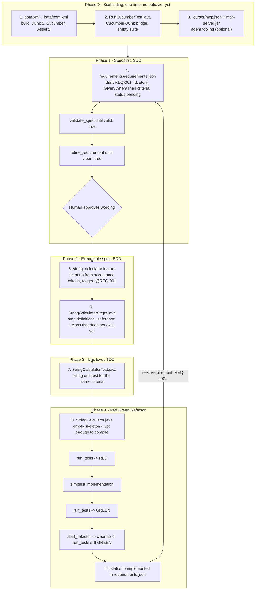

# Greenfield flow: what gets created first, second, and so on

The workshop repo hands you a project where the scaffolding, the spec, and
the first two requirements already exist — so the hour goes to the workflow,
not to plumbing. This page shows the order everything *would* be created in
a true greenfield project driven by spec-first BDD/TDD, using this repo's
actual file names. Read it to understand why the repo looks the way it does
— and to know the build order when you start your own project from zero.

The files split into two groups: **scaffolding** you create once and never
touch again, and **loop artifacts** you revisit for every requirement. The
production class is deliberately the *last* file to exist.

## The order, file by file

**Phase 0 — scaffolding (once, before any behavior exists):**

1. `pom.xml` and `kata/pom.xml` — the build, plus the test dependencies
   (JUnit 5, Cucumber, AssertJ). The project compiles and runs zero tests.
2. `kata/src/test/java/com/davidparry/workshop/kata/RunCucumberTest.java` —
   the bridge that makes Cucumber scenarios run under JUnit. Created once,
   never changed; with no feature files yet it discovers nothing.
3. `.cursor/mcp.json` and the `mcp-server` jar — the agent tooling. Optional
   in the sense that the loop works by hand; in this workshop it is what
   turns the spec into something an agent can be *held to*.

**Phase 1 — the spec is the first meaningful artifact:**

4. `requirements/requirements.json` — draft REQ-001 with an id, a user
   story, Given/When/Then acceptance criteria, and `status: pending`. Then
   the iteration loop from Exercise 1: `validate_spec` until
   `"valid": true`, `refine_requirement` until `"clean": true`, and a human
   approves the wording. Nothing downstream exists until this gate is
   passed.

**Phase 2 — the spec becomes executable (BDD):**

5. `kata/src/test/resources/features/string_calculator.feature` — the first
   Gherkin scenario, written *from* the acceptance criteria and tagged
   `@REQ-001` for traceability.
6. `kata/src/test/java/com/davidparry/workshop/kata/StringCalculatorSteps.java`
   — step definitions binding the Gherkin to code. They reference
   `StringCalculator`, which does not exist yet.

**Phase 3 — the unit level (TDD):**

7. `kata/src/test/java/com/davidparry/workshop/kata/StringCalculatorTest.java`
   — a failing JUnit test for the same criteria. Same bar as the scenario,
   lower altitude.

**Phase 4 — RED, GREEN, REFACTOR:**

8. `kata/src/main/java/com/davidparry/workshop/kata/StringCalculator.java`
   — created **last**, and in two moves. First an empty skeleton (an `add`
   that returns 0 or throws), because until the class exists the tests
   don't fail — they don't *compile*, and a compile error is not a RED bar.
   With the skeleton in place, `run_tests` shows an honest RED from failing
   assertions. Then the simplest implementation → GREEN → `start_refactor`
   → cleanup → still GREEN → flip REQ-001 to `"status": "implemented"` in
   the spec.

## After the first loop

The loop returns to the spec for REQ-002 and every requirement after it.
From here on, only four files ever change:

- `requirements/requirements.json` — the next requirement drafted, refined,
  and later flipped to implemented
- `string_calculator.feature` — scenarios appended
- `StringCalculatorSteps.java` / `StringCalculatorTest.java` — steps reused
  or added, unit tests appended
- `StringCalculator.java` — the simplest change that goes green

The poms, the Cucumber runner, and the MCP config are never touched again —
which is exactly why this workshop ships them pre-built: they are the part
of a greenfield with no lesson in it.
